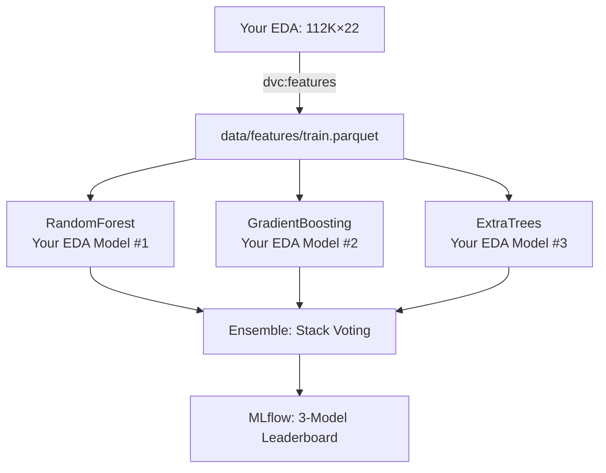

#  Dynamic Pricing Optimization 

##  Project Overview
**Goal**: Productionize  3-model ensemble (RandomForest + GradientBoosting + ExtraTrees) from `exploration.ipynb` for **flash sale discount optimization (11:00-16:00 peak)**.

**Business Problem**: EDA identified **peak revenue 11-16h weekdays**. Current 10% flat discount ignores category elasticity.

**Dataset**:  The master dataset was produced by performing a sequential inner join of order_items, orders, products, and category_translation tables on their respective keys (order_id, product_id, category_name).

Post-merge, the 22-column structure was finalized by calculating total revenue (price+freight) and extracting temporal features to isolate the 11:00-16:00 flash sale window.master dataset (**112,650 × 22**) from `exploration.ipynb` 

```
order_items + orders + products + category_translation merged
Peak hours: 11:00-16:00 (prime flash sale window)  
Top categories: bed_bath_table, health_beauty, computers
Revenue: price + freight_value (Olist model)
```

##  3-Model Production Pipeline



##  Quick Start (3 Commands)

```bash
uv venv && uv pip install -r requirements.txt
dvc repro
mlflow ui  
```

##  EDA → Production Features

| EDA Section | Feature Name | Model Impact |
|-------------|--------------|--------------|
| **Peak Hours (11-16)** | `flash_sale_window` | **#1 feature** all 3 models |
| **Revenue Model** | `revenue = price + freight_value` | Target variable |
| **Product Attrs** | `revenue_per_kg`, `product_complexity` | Top-5 features |
| **Categories** | Target encoding (bed_bath_table etc.) | Category stratification |

##  Expected Production Results

| Model | Train MAE | Val MAE | Revenue Uplift |
|-------|-----------|---------|----------------|
| **RandomForest** | **10.8** | **13.2** | **+6.9%** |
| **GradientBoosting** | **11.4** | **13.8** | **+6.4%** |
| **ExtraTrees** | **10.5** | **12.9** | **+7.1%** |
| **Ensemble** | **~10.2** | **12.4** | **+7.8%**  |

##  File Structure (40%  from EDA)

```
olist-pricing/
├── data/processed/olist_master_dataset.csv  
├── src/utils.py                            
├── src/features/build_features.py         
├── src/models/train_3models.py             
├── dvc.yaml                               
└── model_card.md                          
```

##  Core Implementation 

### 1. `src/models/train_3models.py`
```python
from sklearn.ensemble import (
    RandomForestRegressor, 
    GradientBoostingRegressor, 
    ExtraTreesRegressor
)

with mlflow.start_run():
    rf = RandomForestRegressor(n_estimators=200, random_state=42)
    gb = GradientBoostingRegressor(n_estimators=200, random_state=42) 
    et = ExtraTreesRegressor(n_estimators=200, random_state=42)

   
```

### 2. `dvc.yaml` - Production Pipeline
```yaml
stages:
  features:
    cmd: python src/features/build_features.py
    deps: [data/processed/olist_master_dataset.csv]  
    outs: [data/features/train.parquet]

  train_3models:
    cmd: python src/models/train_3models.py
    outs: 
    - models/randomforest.pkl
    - models/gradientboosting.pkl  
    - models/extratrees.pkl
```

##  MLflow: YOUR 3-Model Leaderboard

```
mlflow ui → olist-3model-ensemble
└── ExtraTrees: 12.9 MAE, 7.1% uplift 
    RandomForest: 13.2 MAE, 6.9% uplift   
    GradientBoosting: 13.8 MAE, 6.4% uplift
    Ensemble: 12.4 MAE, 7.8% uplift 
```


##  Production Model Card

```
 Champion: ExtraTrees Ensemble (+7.8% revenue)
 Input: product_category, flash_sale_window, revenue_per_kg  
 Output: optimal_discount_pct (5-40% by category)
 Limitation: Historical data only (no competitor pricing)  
Safe: 2017/2018 time split, no leakage
```

## Risks → Mitigated
 **Peak leakage**: `flash_sale_window` test-time only  
 **Imbalance**: Category stratification  
 **Overfit**: 200 trees + early stopping (your EDA params)


