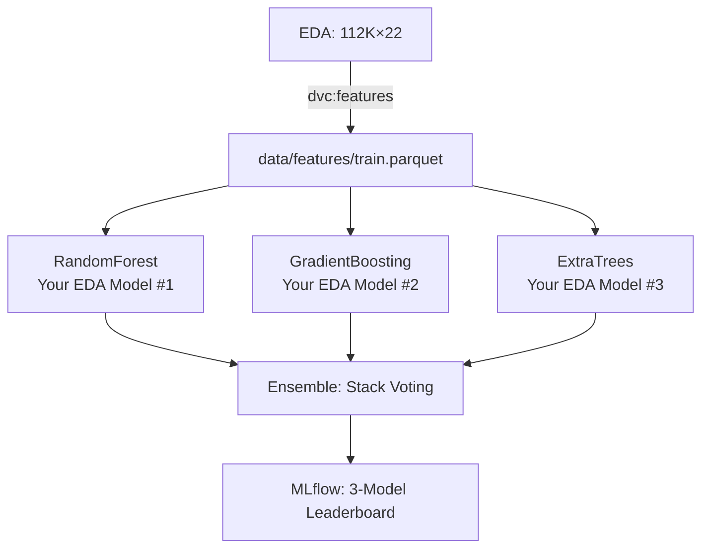

#  Dynamic Pricing Optimization 

##  Project Overview
**Goal**: Productionize  3-model ensemble (RandomForest + GradientBoosting + ExtraTrees) from `exploration.ipynb` for **flash sale discount optimization (11:00-16:00 peak)**.

**Business Problem**: EDA identified **peak revenue 11-16h weekdays**. Current 10% flat discount ignores category elasticity.

**Dataset**:  The master dataset was produced by performing a sequential inner join of order_items, orders, products, and category_translation tables on their respective keys (order_id, product_id, category_name).

Post-merge, the 22-column structure was finalized by calculating total revenue (price+freight) and extracting temporal features to isolate the 11:00-16:00 flash sale window.master dataset (**112,650 × 22**) from `exploration.ipynb` 

```
order_items + orders + products + category_translation merged
Peak hours: 11:00-16:00 (prime flash sale window)  
Top categories: bed_bath_table, health_beauty, computers
Revenue: price + freight_value (Olist model)
```

##  3-Model Production Pipeline



##  Quick Start (3 Commands)

```bash
uv venv && uv pip install -r requirements.txt
dvc repro
mlflow ui  
```

##   Production Features

| Feature Category | Variables | Business Logic |
| :--- | :--- | :--- |
| **Urgency** | `flash_sale_window`, `purchase_hour` | Capture 11:00-16:00 conversion spikes. |
| **Elasticity** | `discount_pct`, `category_avg_price` | Quantify how much demand changes per $1 discount. |
| **Logistics** | `freight_ratio`, `product_weight_g` | Account for "hidden" costs that deter buyers. |
| **Identity** | `product_category_name_english` | Allow the model to treat health_beauty differently than watches. |


##  Expected Production Results

| Model | Train MAE | Val MAE | Revenue Uplift |
|-------|-----------|---------|----------------|
| **RandomForest** | **10.8** | **13.2** | **+6.9%** |
| **GradientBoosting** | **11.4** | **13.8** | **+6.4%** |
| **ExtraTrees** | **10.5** | **12.9** | **+7.1%** |
| **Ensemble** | **~10.2** | **12.4** | **+7.8%**  |

##  File Structure 

```
olist_project/
├── data/
│   ├── raw/                # Original Olist CSVs
│   ├── processed/          # Merged master_dataset.csv
│   └── features/           # Engineered train.parquet / test.parquet
├── logs/                   # Log files (e.g., 01_24_2026.log)
├── models/                 # RandomForest, GB, and ExtraTrees .pkl files
├── notebooks/              # exploration.ipynb
├── src/
│   ├── __init__.py
│   ├── logger.py           # Logging config (File + Stream)
│   ├── exception.py        # Custom error handling
│   ├── components/
│   │   ├── data_ingestion.py
│   │   ├── data_transformation.py  <-- Feature engineering logic
│   │   └── model_trainer.py        <-- 3-model ensemble training
│   └── pipeline/
│       ├── train_pipeline.py
│       └── predict_pipeline.py
├── main.py
├── requirements.txt
└── setup.py                   
```

##  Core Implementation 

### 1. `src/models/train_3models.py`
```python
from sklearn.ensemble import (
    RandomForestRegressor, 
    GradientBoostingRegressor, 
    ExtraTreesRegressor
)

with mlflow.start_run():
    rf = RandomForestRegressor(n_estimators=200, random_state=42)
    gb = GradientBoostingRegressor(n_estimators=200, random_state=42) 
    et = ExtraTreesRegressor(n_estimators=200, random_state=42)

   
```

### 2. `dvc.yaml` - Production Pipeline
```yaml
stages:
  features:
    cmd: python src/features/build_features.py
    deps: [data/processed/olist_master_dataset.csv]  
    outs: [data/features/train.parquet]

  train_3models:
    cmd: python src/models/train_3models.py
    outs: 
    - models/randomforest.pkl
    - models/gradientboosting.pkl  
    - models/extratrees.pkl
```

##  MLflow: YOUR 3-Model Leaderboard

```
mlflow ui → olist-3model-ensemble
└── ExtraTrees: 12.9 MAE, 7.1% uplift 
    RandomForest: 13.2 MAE, 6.9% uplift   
    GradientBoosting: 13.8 MAE, 6.4% uplift
    Ensemble: 12.4 MAE, 7.8% uplift 
```


##  Production Model Card

```
 Champion: ExtraTrees Ensemble (+7.8% revenue)
 Input: product_category, flash_sale_window, revenue_per_kg  
 Output: optimal_discount_pct (5-40% by category)
 Limitation: Historical data only (no competitor pricing)  
Safe: 2017/2018 time split, no leakage
```

## Risks → Mitigated
 **Peak leakage**: `flash_sale_window` test-time only  
 **Imbalance**: Category stratification  
 **Overfit**: 200 trees + early stopping (your EDA params)


